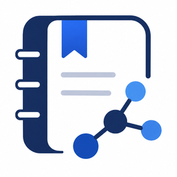

<p align="center">
  
</p>

<h1 align="center">Noteration: Note-Literature-Synchronization</h1>

<p align="center">
  <strong>Research Literature Note-Taking App</strong><br>
  Markdown editor · PDF viewer · Papis · GitHub sync
</p>

<p align="center">
  <a href="https://github.com/lilamr/noteration/releases"></a>
  <a href="https://github.com/lilamr/noteration/blob/main/LICENSE"></a>
  <a href="https://www.python.org/downloads/"></a>
  <a href="https://github.com/lilamr/noteration/actions"></a>
</p>

---

## About

Noteration is a desktop application for managing literature notes in an integrated way. It combines all the tools you need in a single interface:

```
noteration/
├── 📄  Markdown notes with [[wiki-link]] and @citation
├── 📘  Integrated PDF viewer with non-destructive annotations
├── 📚  Literature browser via Papis
├── 🔍  Global vault search
├── 🕸️  Interactive backlink graph between notes
└── ☁️  Automated synchronization via GitHub
```

---

## Key Features

| Feature | Description |
|-------|------------|
| **Markdown Editor** | Syntax highlighting, line numbers, view/edit modes, auto-indent |
| **Wiki-link** | `[[note-name]]` with `Ctrl+Click` navigation and autocomplete |
| **Citation** | `@citation-key` with autocomplete from Papis library |
| **Global Search** | Search across all notes, literature, and PDF annotations simultaneously |
| **PDF Viewer** | Render via QtPDF or PyMuPDF, highlight & JSON annotations |
| **Backlink Graph** | Visualization of note network, interactive |
| **Papis Bridge** | Browse, import, and export BibTeX from Papis library |
| **Git Sync** | Automated commit, pull, push; visual conflict resolution |
| **Dark Mode** | Light / Dark / System — automatically follows OS theme |

---

## Installation

```bash
# Clone repository
git clone https://github.com/lilamr/noteration.git
cd noteration

# Install basic dependencies
pip install -e .

# Install all optional features at once
pip install -e ".[all]"
```

### Optional Dependencies

| Feature | Command |
|-------|----------|
| Papis literature management | `pip install -e ".[papis]"` |
| PyMuPDF PDF renderer | `pip install -e ".[pymupdf]"` |
| Fuzzy search | `pip install -e ".[search]"` |
| Backlink graph (NetworkX) | `pip install -e ".[graph]"` |
| File watcher (live reload) | `pip install -e ".[watch]"` |
| Markdown preview | `pip install -e ".[markdown]"` |

> **Note:** Python 3.11+ is required. PySide6 ≥ 6.4 includes built-in QtPDF.

---

## Running the Application

```bash
# Via entry point (after pip install -e .)
noteration

# Or directly as a module
python -m noteration
```

On first run, a **Select Vault** dialog will appear to choose or create a new research vault.

---

## Vault Structure

```
~/noteration-vault/
├── .noteration/
│   ├── config.toml          # Main configuration
│   ├── db.sqlite            # Cache & link graph
│   └── link_graph.json      # Backlink graph (JSON)
├── notes/                   # Markdown files
│   ├── index.md
│   └── research-topic.md
├── literature/              # Managed by Papis
├── annotations/             # PDF annotations (JSON, synced via Git)
└── attachments/             # Images and attachments
```

---

## Configuration (`config.toml`)

```toml
[general]
autosave          = true
autosave_interval = 30           # seconds

[editor]
tab_width         = 2
font_family       = "Consolas"
font_size         = 12
show_line_numbers = true
auto_indent       = true

[pdf]
renderer              = "qtpdf"   # or "pymupdf"
default_highlight_color = "#FFEB3B"

[papis]
library_path = "~/noteration/literature"

[sync]
auto_sync     = true
sync_interval = 300              # seconds
remote        = "origin"
branch        = "main"

[ui]
theme           = "system"       # dark / light / system
sidebar_visible = true
```

---

## Project Structure

```
noteration/
├── assets/
├── docs/
├── noteration/
│   ├── app.py               # Bootstrap & QApplication
│   ├── config.py            # TOML Configuration
│   ├── db/                  # Link graph & layout engine
│   ├── dialogs/             # Dialogs (vault, note, settings, conflict)
│   ├── editor/              # Find/Replace, syntax highlight, wiki-link
│   ├── literature/          # Papis bridge & BibTeX export
│   ├── pdf/                 # PDF reader & annotations
│   ├── search/              # Global vault search
│   ├── sync/                # Git engine
│   └── ui/                  # Main window, tabs, sidebar, graph
├── tests/                   # Pytest test suite
└── pyproject.toml
```

---

## Contribution

Contributions are welcome! Check [Issues](https://github.com/lilamr/noteration/issues) for a list of things to work on, or open a new issue to report a bug or suggest a feature.

```bash
# Setup development environment
pip install -e ".[all,dev]"

# Run tests
pytest -v
mypy .

# Linting
ruff check .
```

---

## Author

Created by **[lilamr](https://github.com/lilamr)**.

---

## License

[MIT License](LICENSE) — free to use, modify, and distribute.

---

<p align="center">
  Built with PySide6 · PyMuPDF · GitPython · NetworkX · Papis
</p>
