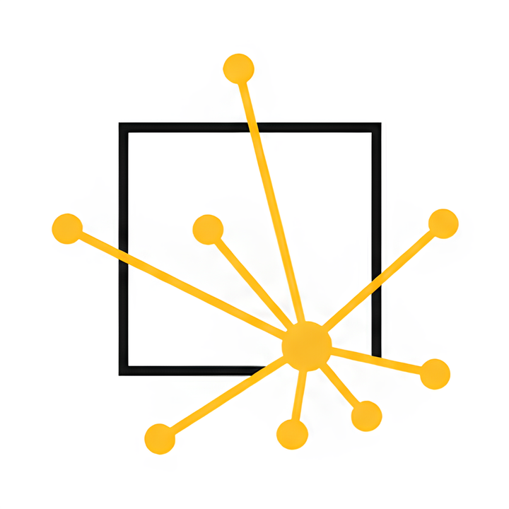

<p align="center">
  
</p>

<h1 align="center">Noteration: Note-Literature-Synchronization</h1>

<p align="center">
  <strong>Research Literature Note-Taking App</strong><br>
  Markdown editor · PDF viewer · Papis · GitHub sync
</p>

<p align="center">
  <a href="https://github.com/lilamr/noteration/releases/tag/v2.3.0"></a>
  <a href="https://github.com/lilamr/noteration/blob/main/LICENSE"></a>
  <a href="https://www.python.org/downloads/"></a>
  <a href="https://github.com/lilamr/noteration/actions"></a>
</p>

---

## About

Noteration is a desktop application for managing literature notes in an integrated way. It combines all the tools you need in a single interface:

```
noteration/
├── 📄  Markdown notes with [[wiki-link]] and @citation[p.xx]
├── 📘  Integrated PDF viewer with non-destructive annotations
├── 📚  Literature browser via Papis
├── 🔍  Global vault search (Persistent)
├── 🕸️  Interactive backlink graph between notes
└── ☁️  Synchronization via GitHub
```

---

## Key Features

| Feature | Description |
|-------|------------|
| **Markdown Editor** | Syntax highlighting, line numbers, view/edit modes, auto-indent, math support |
| **Split View** | Vertical side-by-side editing and reading for better productivity |
| **Focus Mode** | Distraction-free writing with Vim keybindings and centered layout |
| **Wiki-link** | `[[note-name]]` with `Ctrl+Click` navigation and autocomplete |
| **Tags** | Support for `#tag` with dedicated sidebar management |
| **Citation** | `@citation-key[p.xx]` autocomplete, CSL styles, PDF deep-linking |
| **Global Search** | High-performance SQLite FTS5, deep-linking, persistent dialog |
| **PDF Viewer** | Render via QtPDF or PyMuPDF, highlight & JSON annotations, toggleable panel |
| **Backlink Graph** | Visualization of note network, interactive |
| **Git Sync** | Manual commit, pull, push; visual conflict resolution |
| **CLI (`ntr`)** | Manage vault, search, and sync via terminal |
| **REST API** | Lightweight HTTP interface for integration |
| **Encryption** | Transparent vault encryption using **age** |
| **Dark Mode** | Light / Dark / System — automatically follows OS theme |

---

## Installation

Choose the quickest way to get Noteration running on your system.

### 📦 Download Installer (Recommended)

Get the latest stable version from the [**GitHub Releases**](https://github.com/lilamr/noteration/releases/latest) page.

| Platform | File | How to install |
|---|---|---|
| **Linux** (Ubuntu/Debian) | `.deb` | `sudo dpkg -i noteration_*.deb` |
| **Windows** | `.exe` | Run the `Noteration-Setup-*.exe` |
| **macOS** | `.dmg` | Open and drag `Noteration.app` to Applications |

### 🚀 One-liner Installers

Alternatively, use these commands for a quick scripted setup:

#### 🐧 Linux & 🍎 macOS

Open your terminal and run:
```bash
curl -fsSL https://raw.githubusercontent.com/lilamr/noteration/main/install.sh | bash
```
*On macOS, this will create a **Noteration.app** in your Applications folder and add it to your Launchpad.*

#### 🪟 Windows

Open PowerShell and run:
```powershell
irm https://raw.githubusercontent.com/lilamr/noteration/main/install.ps1 | iex
```
*This will create a desktop shortcut and a Start Menu entry for easy access.*

### Manual Installation (Development)

If you want to contribute or prefer manual setup:

#### 1. Prerequisites
- Python 3.11 or higher
- Git

#### 2. Clone and Setup
```bash
git clone https://github.com/lilamr/noteration.git
cd noteration

# Create and activate virtual environment
python3 -m venv .venv
source .venv/bin/activate  # On Windows use: .venv\Scripts\activate

# Install with all features
pip install -e ".[all]"
```

#### 3. Optional Dependencies
| Feature | Command |
|-------|----------|
| Papis & CSL Citations | `pip install -e ".[papis]"` |
| PyMuPDF PDF renderer | `pip install -e ".[pymupdf]"` |
| Fuzzy search (literature) | `pip install -e ".[search]"` |
| Backlink graph (NetworkX) | `pip install -e ".[graph]"` |
| File watcher (live reload) | `pip install -e ".[watch]"` |
| Markdown & Math preview | `pip install -e ".[markdown]"` |

#### 4. Running the Application

```bash
# Via entry point (after pip install -e .)
noteration

# Or directly as a module
python -m noteration
```

---

## Uninstallation

If you need to remove Noteration, follow the steps for your installation method:

### 📦 Binary Installer

- **Linux**: `sudo apt remove noteration`
- **Windows**: Use **Add or Remove Programs** in Settings, or run the `unins000.exe` in the installation folder.
- **macOS**: Delete `Noteration.app` from your **Applications** folder.

### 🚀 One-liner Script (Manual removal)

#### 🐧 Linux
```bash
# Remove installation directory and venv
rm -rf ~/.local/share/noteration

# Remove wrapper script
rm ~/.local/bin/noteration

# Remove desktop entry and icon
rm ~/.local/share/applications/noteration.desktop
rm ~/.local/share/icons/noteration.png
```

#### 🍎 macOS
```bash
# Remove App Bundle
rm -rf ~/Applications/Noteration.app

# Remove installation directory and binary
rm -rf ~/.local/share/noteration
rm ~/.local/bin/noteration
```

#### 🪟 Windows (PowerShell)
```powershell
# Remove installation directory
Remove-Item -Recurse -Force "$env:LOCALAPPDATA\noteration"

# Remove shortcuts
Remove-Item "$env:USERPROFILE\Desktop\Noteration.lnk" -ErrorAction SilentlyContinue
Remove-Item "$env:APPDATA\Microsoft\Windows\Start Menu\Programs\Noteration.lnk" -ErrorAction SilentlyContinue
```

> [!NOTE]
> These steps remove the application itself. Your **Vault data** (notes, literature, annotations and config) is stored separately and will not be deleted.

---

## Vault Structure

On first run, a **Select Vault** dialog will appear to choose or create a new research vault. A Noteration vault is a standard directory that remains fully functional even without the app.

```
~/research-vault/
├── .noteration/
│   ├── config.toml          # Main configuration (Schema v1)
│   ├── search.db            # SQLite FTS5 index & metadata
│   └── link_graph.json      # Serialized backlink network
├── notes/                   # Your Markdown notes
│   ├── index.md
│   └── methodology.md
├── literature/              # Managed by Papis (info.yaml + PDFs)
├── annotations/             # PDF annotations (JSON)
└── attachments/             # Images and other project assets
```

> [!TIP]
> **Git Synchronization:** Noteration automatically ignores large binary files (PDFs) and internal caches (`db.sqlite`, `link_graph.json`) to prevent merge conflicts and repository bloat. Only your notes, metadata, and annotations are synchronized.

### Vault Encryption
Noteration supports transparent vault encryption using the [age](https://age-encryption.org) format, with cryptographic operations natively integrated into the application. Encryption can be enabled or permanently disabled at any time through the settings.

---

## CLI & REST API

> [!IMPORTANT]
> The `ntr` and `ntr-api` commands are **only available** if you install Noteration using the **One-liner** scripts or **Manual (pip)** method. The pre-compiled binary installers (.deb, .exe, .dmg) only include the GUI application.

Noteration provides powerful terminal and programmatic access via `ntr` and `ntr-api`.

### Command Line Interface (`ntr`)
Manage your vault, search, and sync directly from the terminal.
```bash
# Search across notes
ntr search "machine learning"

# Sync all changes
ntr sync all -m "Update chapter 2"
```
See the [CLI User Guide](noteration/docs/user_guide_cli.md) for details.

### REST API (`ntr-api`)
Expose your vault via HTTP for integration with external tools.
```bash
# Start the API server
ntr api start --port 8765
```
See the [REST API User Guide](noteration/docs/user_guide_api.md) for details.

---

## Configuration (`config.toml`)

```toml
[general]
autosave          = true
autosave_interval = 30           # seconds

[editor]
tab_width         = 2
font_family       = "Consolas"
font_size         = 12
show_line_numbers = true
auto_indent       = true

[pdf]
renderer              = "qtpdf"   # or "pymupdf"
default_highlight_color = "#FFEB3B"

[papis]
library_path = "~/noteration/literature"

[sync]
remote        = "origin"
branch        = ""               # empty = auto-detect active branch

[ui]
theme           = "system"       # dark / light / system
sidebar_visible = true
```

---

## Project Structure

Noteration follows a decoupled architecture separating business logic from the GUI.

```
noteration/ (repository root)
├── noteration/ (package)
│   ├── core/                # Pure Python business logic (VaultCore)
│   ├── cli/                 # Command Line Interface (ntr)
│   ├── api/                 # REST API Server (ntr-api)
│   ├── controllers/         # Qt Adapters (Index, Sync, Library)
│   ├── search/              # SQLite FTS5 engine & Search logic
│   ├── literature/          # Papis bridge & CSL rendering
│   ├── ui/                  # PySide6 Components (MainWindow, Tabs)
│   ├── editor/              # Markdown logic (Highlighter, MathJax)
│   ├── pdf/                 # PDF Engine (PyMuPDF / QtPDF)
│   ├── sync/                # GitPython synchronization engine
│   ├── dialogs/             # UI Dialogs (Settings, Encryption, Search)
│   ├── db/                  # Graph database & layout logic
│   ├── utils/               # Export (Pandoc), Encryption (age)
│   ├── docs/                # In-app help (User Guide)
│   └── assets/              # App icons and logos
├── noteration-web/          # Product landing page source
├── tests/                   # Pytest suite (Unit & Integration)
└── pyproject.toml           # Build system and dependencies
```

---

## Contribution

Contributions are welcome! Check [Issues](https://github.com/lilamr/noteration/issues) for a list of things to work on, or open a new issue to report a bug or suggest a feature.

```bash
# Setup development environment
pip install -e ".[all,dev]"

# Run tests
pytest -v
mypy .
ruff check .
ruff check --select S .
```

---

## Author

Created by **[lilamr](https://github.com/lilamr)**. 

[](https://ko-fi.com/R6R11Z1NDP)

---

## License

[MIT License](LICENSE) — free to use, modify, and distribute.

---

<p align="center">
  Built with PySide6 · PyMuPDF · GitPython · NetworkX · Papis · MathJax
</p>
